# Integrating OneSignal into a Next.js App

Created: May 11, 2021 Created by: William Shepherd Tags: Work

In this walkthrough, I'll be covering how to leverage OneSignal in a React app
built using the [Next.JS](https://nextjs.org/) framework. This article assumes
that you already know a little about Next.JS; my focus will be on the OneSignal
integration. To make this guide as applicable to as many people as possible, I
will start from scratch.

###### Marketing product info

## My system

At the time of writing, I had the following dependencies installed on my system:

- macOS 11.3.1
- [Node v14.15.1](https://github.com/nodejs/node/releases/tag/v14.15.1)
- [Yarn 1.22.10](https://github.com/yarnpkg/yarn/releases/tag/v1.22.10)
- [Next.js v10.2.0](https://github.com/vercel/next.js/releases/tag/v10.2.0)
  (latest at the time of writing)

You should be able to follow along so long as you have Node version 14 or later.

## Create your Next app

Execute `yarn create next-app`.

```bash
╭─iamwillshepherd@ares ~/code/onesignal-nextjs ‹main›
╰─$ yarn create next-app .
yarn create v1.22.10
[1/4] 🔍  Resolving packages...
[2/4] 🚚  Fetching packages...
[3/4] 🔗  Linking dependencies...
[4/4] 🔨  Building fresh packages...

success Installed "create-next-app@10.2.0" with binaries:
      - create-next-app
[##] 2/2Creating a new Next.js app in /Users/iamwillshepherd/code/onesignal-nextjs.

Installing react, react-dom, and next using yarn...
```

When the command completes, you should see console output similar to mine.

```bash
Success! Created onesignal-nexgtjs at /Users/iamwillshepherd/code/onesignal-nextjs
Inside that directory, you can run several commands:

  yarn dev
    Starts the development server.

  yarn build
    Builds the app for production.

  yarn start
    Runs the built app in production mode.

We suggest that you begin by typing:

  cd /Users/iamwillshepherd/code/onesignal-nextjs
  yarn dev

✨  Done in 4.75s.
```

I'm deferring to the excellent [Next docs](https://nextjs.org/docs) to explain
what this (☝🏾) command does.

Execute `yarn dev` to verify the app works as expected.

```bash
╭─iamwillshepherd@ares ~/code/onesignal-nextjs ‹main*›
╰─$ yarn dev
yarn run v1.22.10
$ next dev
ready - started server on 0.0.0.0:3000, url: http://localhost:3000
info  - Using webpack 5. Reason: no next.config.js https://nextjs.org/docs/messages/webpack5
event - compiled successfully
event - build page: /next/dist/pages/_error
wait  - compiling...
event - compiled successfully
```

Navigate to the URL returned in the output with your browser of choice.

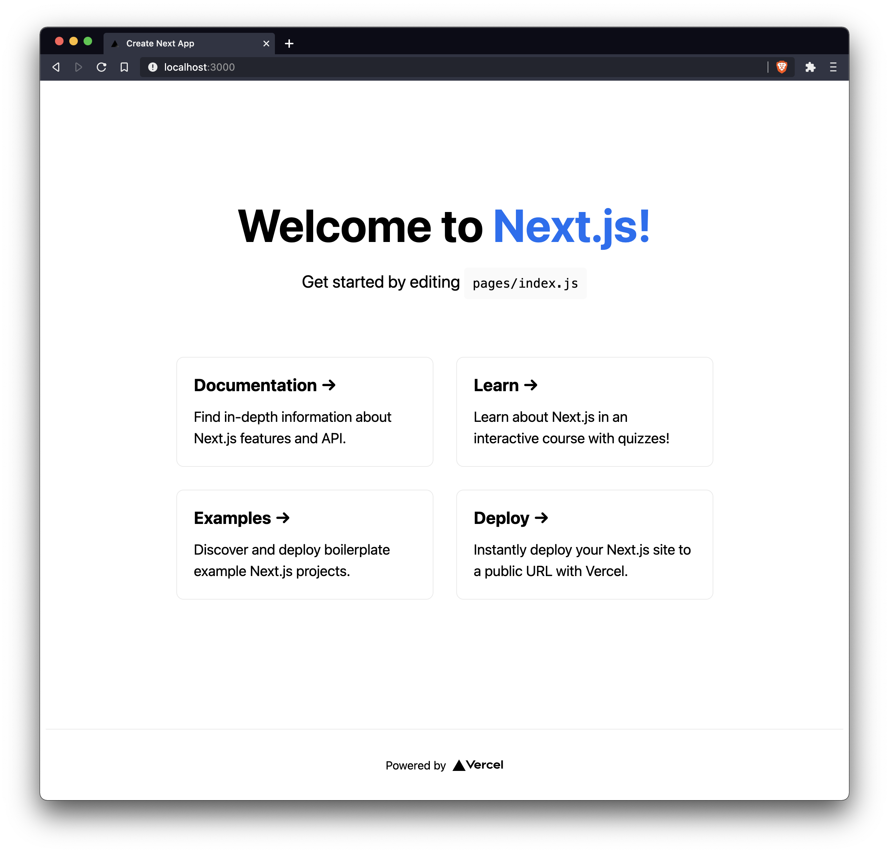

The expected result when navigating to URL in run output.

## Get the OneSignal SDK Service Workers

OneSignal allows you to integrate with dozens of 3rd parties, including the web
platform. Because I'm integrating OneSignal into a React app, I must manually
add the SDK service workers to the app. OneSignal documents how to accomplish
this in the
[Custom Code Setup doc](https://documentation.onesignal.com/docs/web-push-custom-code-setup).

Download the OneSignal SDK archive (found
[here](https://documentation.onesignal.com/docs/web-push-custom-code-setup#step-3-upload-onesignal-sdk)).

Unzip the archive contents into your project into the `public` directory of your
Next app.

```bash
╭─iamwillshepherd@ares ~/code/onesignal-nextjs ‹main›
╰─$ unzip ~/Downloads/OneSignal-Web-SDK-HTTPS-Integration-Files.zip -d public
Archive:  /Users/iamwillshepherd/Downloads/OneSignal-Web-SDK-HTTPS-Integration-Files.zip
   creating: public/OneSignal-Web-SDK-HTTPS-Integration-Files/
  inflating: public/OneSignal-Web-SDK-HTTPS-Integration-Files/.DS_Store
   creating: public/__MACOSX/
   creating: public/__MACOSX/OneSignal-Web-SDK-HTTPS-Integration-Files/
  inflating: public/__MACOSX/OneSignal-Web-SDK-HTTPS-Integration-Files/._.DS_Store
  inflating: public/OneSignal-Web-SDK-HTTPS-Integration-Files/OneSignalSDKWorker.js
  inflating: public/__MACOSX/OneSignal-Web-SDK-HTTPS-Integration-Files/._OneSignalSDKWorker.js
  inflating: public/OneSignal-Web-SDK-HTTPS-Integration-Files/OneSignalSDKUpdaterWorker.js
  inflating: public/__MACOSX/OneSignal-Web-SDK-HTTPS-Integration-Files/._OneSignalSDKUpdaterWorker.js
  inflating: public/__MACOSX/._OneSignal-Web-SDK-HTTPS-Integration-Files
```

The OneSignal Web SDK directory contains service workers that do the heavy
lifting of handling notifications. These service workers must be publicly
accessible, so we use Next's
[static file servicing](https://nextjs.org/docs/basic-features/static-file-serving)
to achieve this.

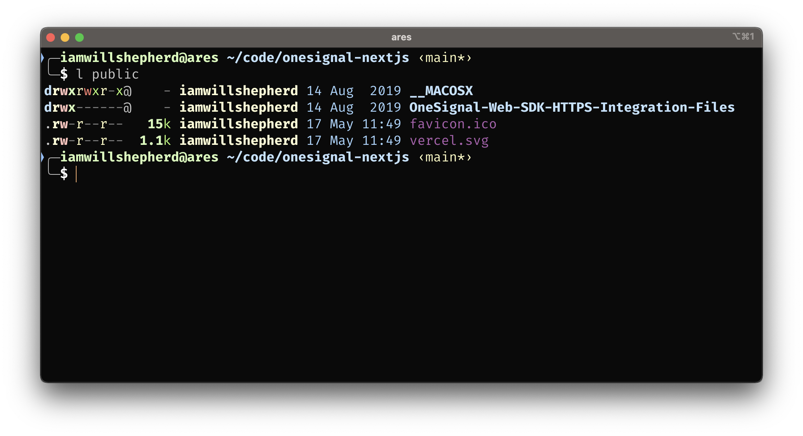

Ignore the contents of `public` and `__MACOSX`.

Move all JavaScript files from `OneSignal-Web-SDK/` to `public/`.

```bash
╭─iamwillshepherd@ares ~/code/onesignal-nextjs/public ‹main*›
╰─$ mv OneSignal-Web-SDK-HTTPS-Integration-Files/*.js .
```

Confirm the files have been moved.

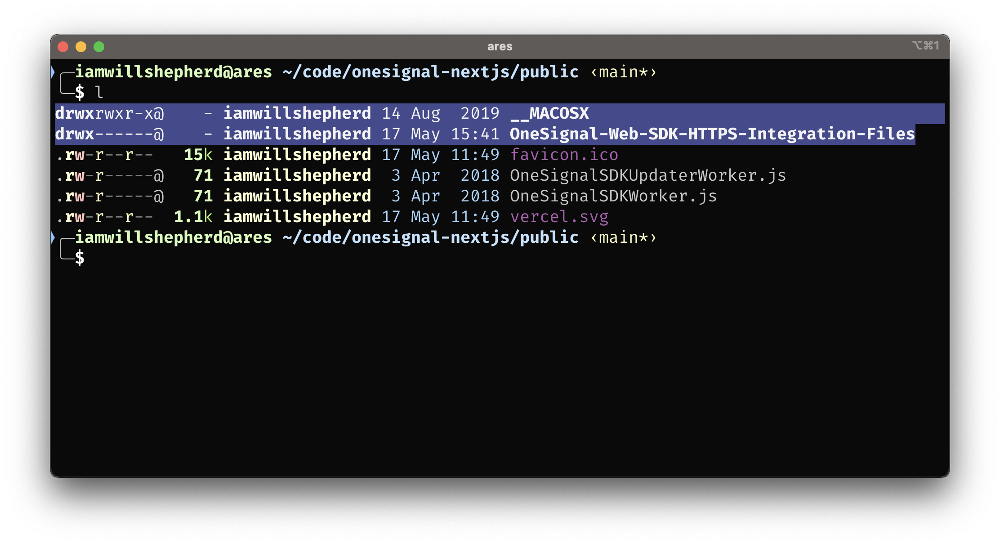

Remove the highlighted files.

Cleanup the `public` directory.

```bash
╭─iamwillshepherd@ares ~/code/onesignal-nextjs/public ‹main*›
╰─$ rm -rf __MACOSX OneSignal-Web-*
```

## Add OneSignal SDK Script

The OneSignal SDK script must be loaded to make use of the two service workers.
Add the OneSignalSDK script under the `Head` component in `pages/index.js`.

```html
<head>
  <title>OneSignal + Next.js</title>
  <meta
    name="description"
    content="Integrating OneSignal with a Next.js app."
  />
  <link rel="icon" href="/favicon.ico" />
  <script
    src="https://cdn.onesignal.com/sdks/OneSignalSDK.js"
    async=""
  ></script>
</head>
```

At this point, we have most of the setup complete for the web app; we only need
to initialize an OneSignalSDK instance.

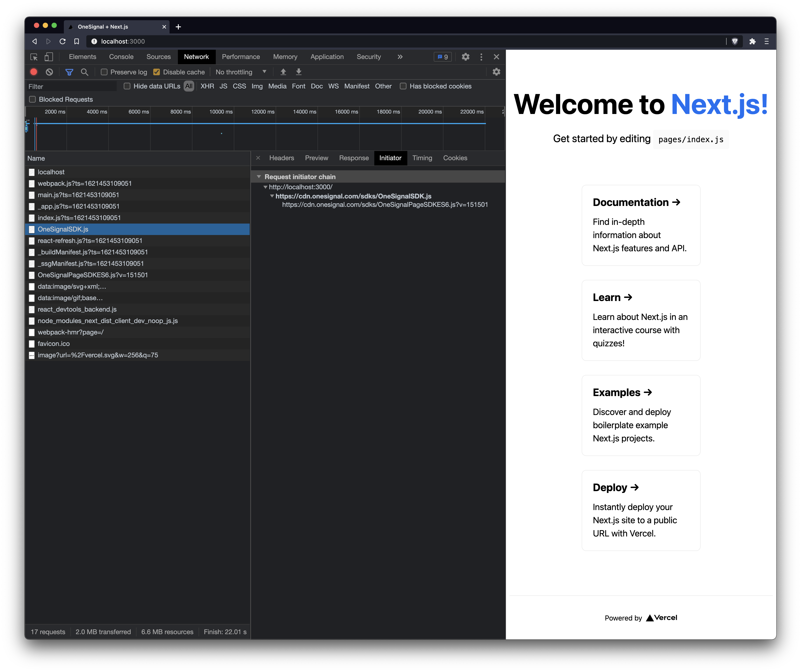

OneSignalSDK successfully loaded.


OneSignal is now available on the global `window` object.

## Initialize the OneSignal SDK Part 1

Custom code integrations require a bit of JavaScript code to initialize
OneSignal. I'm going to focus on HTTP initialization because more people will be
able to follow along. HTTPS initialization is very similar to what I'm covering
here, so this guide may still be helpful to you.

According to the
[example code](https://documentation.onesignal.com/docs/web-push-custom-code-examples#custom-code-http-initialization)
in OneSignal's docs, this is how to initialize OneSignal on a site using custom
code.

```html
<head>
  <script
    src="https://cdn.onesignal.com/sdks/OneSignalSDK.js"
    async=""
  ></script>
  <script>
      var OneSignal = window.OneSignal || [];
      OneSignal.push(function() {
        OneSignal.init({
          appId: "YOUR_APP_ID",
          subdomainName:"YOUR_LABEL"/* The label for your site that you added in Site Setup mylabel.os.tc */
          notifyButton: {
            enable: true,
          },
        });
      });
    // OneSignal.showNativePrompt(); // <-- For HTTPS initialization
  </script>
</head>
```

Next.js uses React to render the app, so I have to handle the initialization of
the SDK in a way that works with the framework. React provides a mechanism to
perform side effects on page load: `useEffect` (read the
[doc](https://reactjs.org/docs/hooks-effect.html) to learn more). This hook
allows code to execute when the page is mounted, which is necessary to init
OneSignal.

### Creating a Hook

Create a file named `utils/useOneSignal.js` inside the workspace.

```bash
╭─iamwillshepherd@ares ~/code/onesignal-nextjs ‹main*›
╰─$ mkdir utils && touch utils/useOneSignal.js
```

Copy `useEffect` boilerplate into the file.

```jsx
import { useEffect } from "react";

const useOneSignal = () =>
  useEffect(() => {
    console.log("init OneSignal...");

    return () => {
      console.log("cleanup OneSignal");
    };
  }, []); // <-- run this effect once on mount

export default useOneSignal;
```

Note that I'm passing an empty list, `[]`, to `useEffect` because I only want
the effect to run once, when the page is mounted (learn more about conditionally
running an effect
[here](https://reactjs.org/docs/hooks-reference.html#conditionally-firing-an-effect)).

### Using OneSignal Hook

Call the hook in `pages/_app.js` so OneSignalSDK is available to all pages.


I am calling `useOneSignal` before rendering the app.

When refreshing the app, the effect should write a message to the console once
mounted.

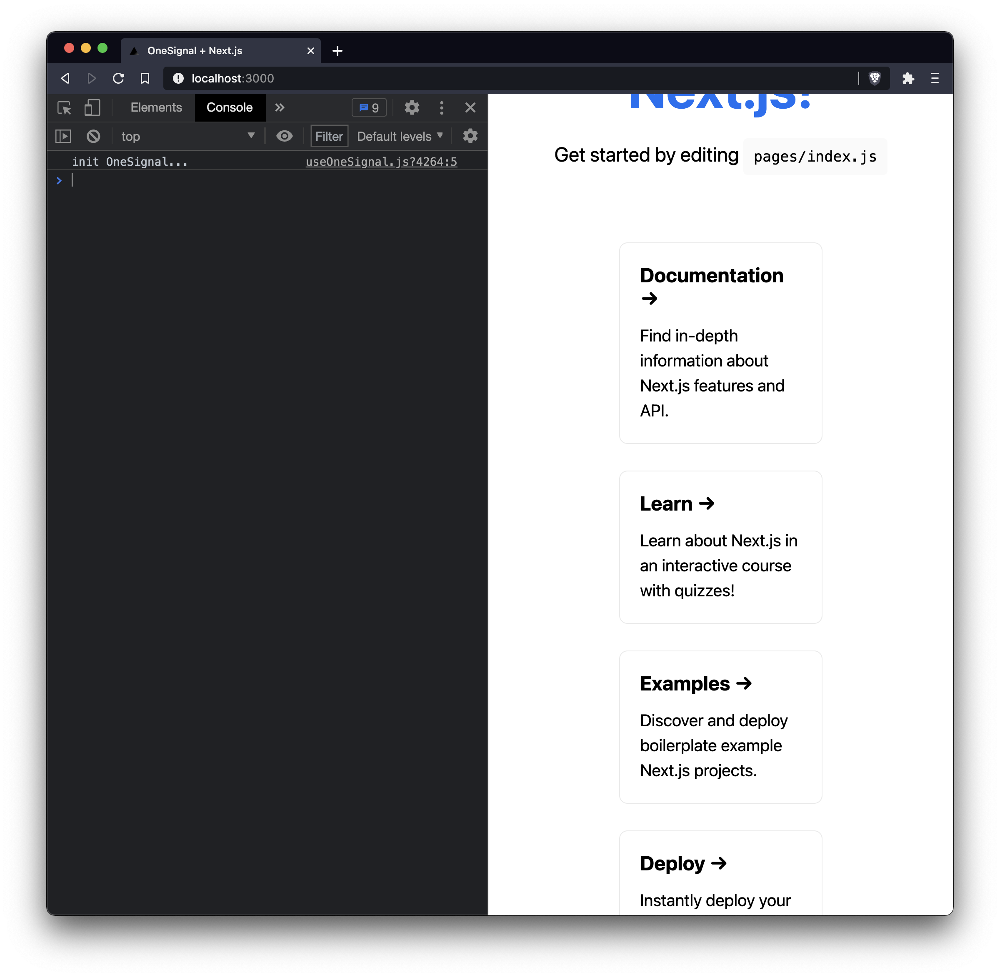

Side-effects of OneSignal hook.

We'll return to the `useOneSignal` hook after getting the ID needed to
initialize the OneSignal SDK.

## OneSignal

OneSignal needs a unique key called `appId` to initialize the SDK. You can
obtain this key by logging into your
[OneSignal account](https://app.onesignal.com/); If you don't have an account,
you will need to [signup for one](https://app.onesignal.com/signup) before
continuing this tutorial.

### Create App

On the first login, you're presented with a getting started page. Fill out the
form and select the _Web_ platform.

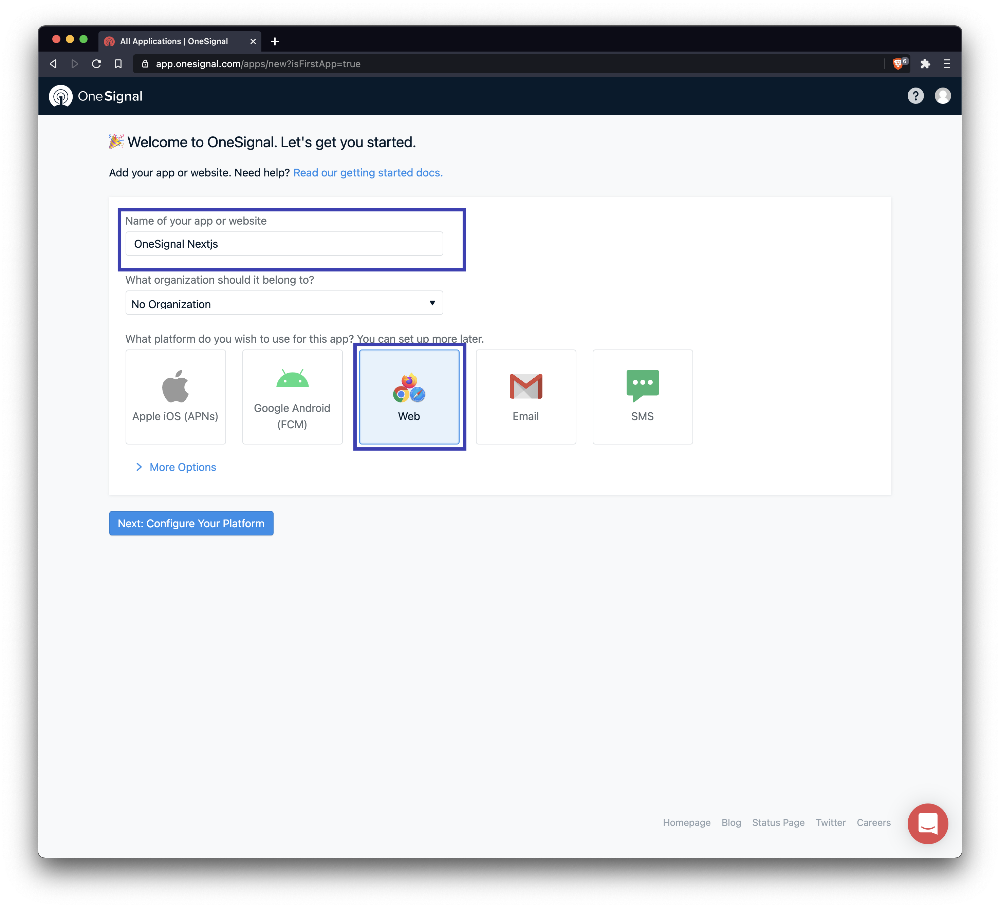

Creating a new app for the Web platform named _OneSignal Nextjs._

If you already have existing apps, you can create a new one using the Apps
dropdown menu.

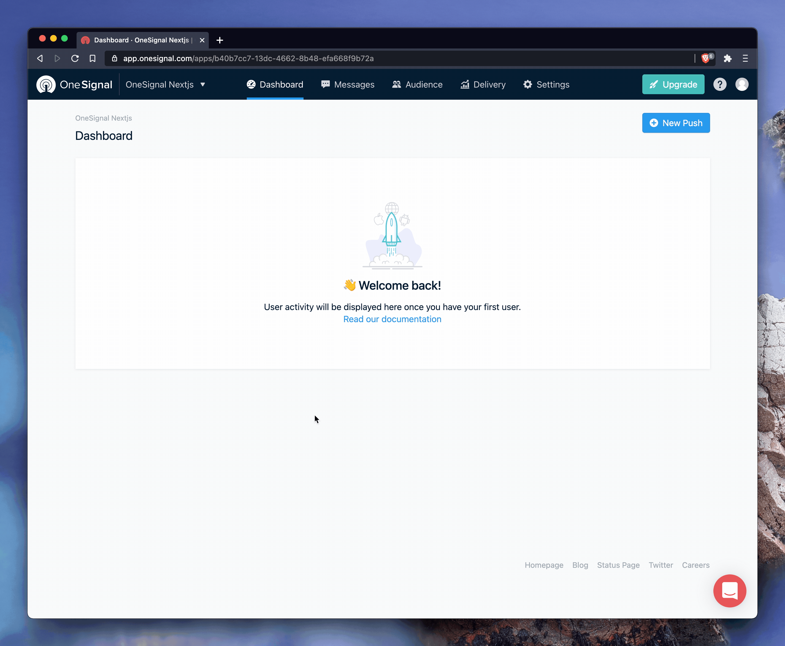

Selecting New App from the app dropdown.

### Configure App Platform

Select the _Custom Code_ integration and fill out the form in the **Site Setup**
section.


Configuring Custom Code integration

Note that I'm using `[http://localhost:3000](http://localhost:3000)` for my site
URL because my dev server serves the site there. Once you're ready to deploy
your site, you would change this URL to point to your domain. You'll also want
to double-check that you enable the _Local Testing_ option, allowing the
integration to work in a development environment.

Click the **Save** to complete the application**.**

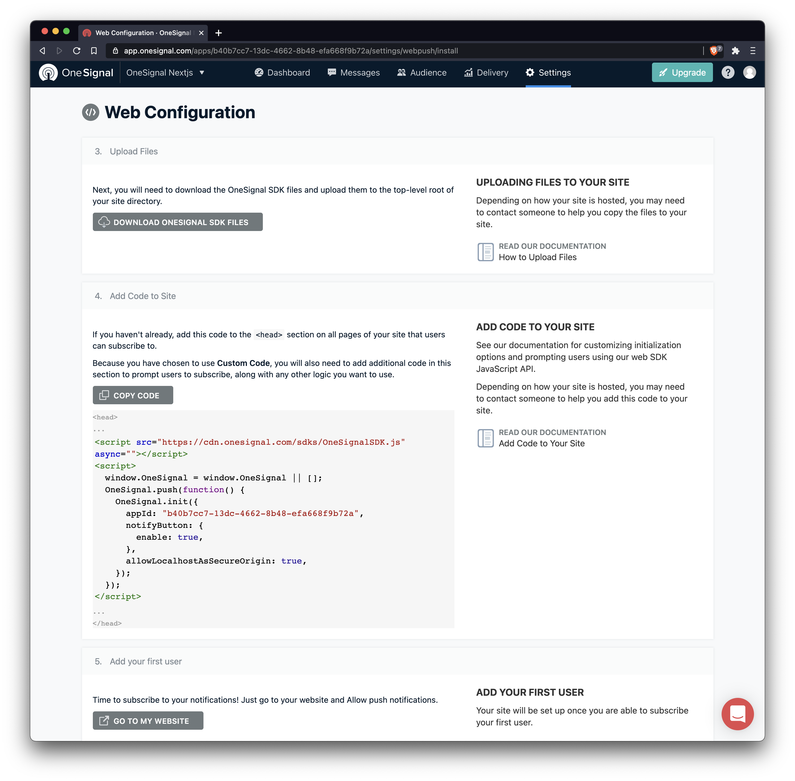

The final page of the app creation process reveals `appId` in the second script.

Copy the content of the second script.

## Initialize the OneSignal SDK Part 2

Paste the content inside the callback passed to `useEffect` in
`utils/useOneSignal.js`.

```diff
---
+++
@@ -1,8 +1,18 @@
 const useOneSignal = () =>
   useEffect(() => {
-    console.log("init OneSignal...");
+    window.OneSignal = window.OneSignal || [];
+    OneSignal.push(function () {
+      OneSignal.init({
+        appId: "b40b7cc7-13dc-4662-8b48-efa668f9b72a",
+        notifyButton: {
+          enable: true,
+        },

+        allowLocalhostAsSecureOrigin: true,
+      });
+    });

     return () => {
-      console.log("cleanup OneSignal");
+      window.OneSignal = undefined;
     };
   }, []); // <-- run this effect once on mount
```

The diff illustrates what edits should be made to initialize the SDK ☝🏾

Reloading the app should reveal a new UI element at the bottom-right corner of
the browser viewport.

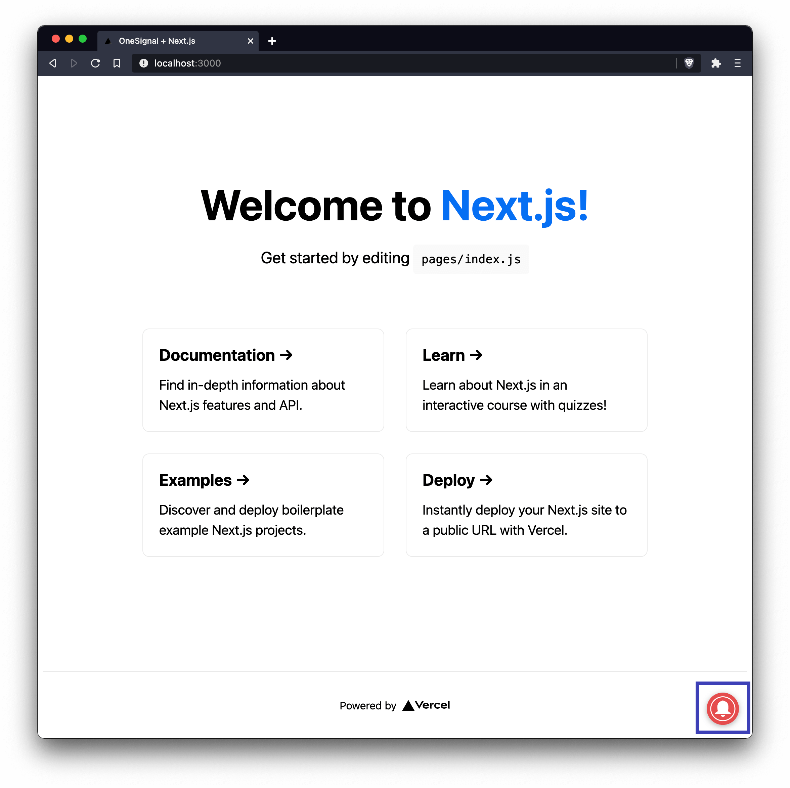

The new button is how visitors to the site can subscribe to notifications.

## Pushing a Notification

Now that the integration is complete, we can test it out. Subscribe to
notifications.


Subscribing to notifications.

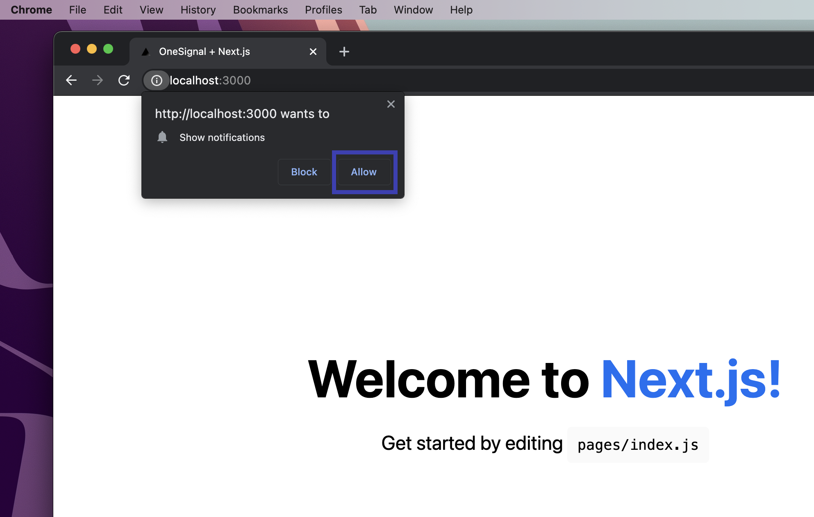

Confirmation dialog that doesn't appear in the last GIF.

### Confirm the Subscription

Navigate to your [OneSignal account](https://app.onesignal.com/) and select the
_OneSignal Nextjs_ app.

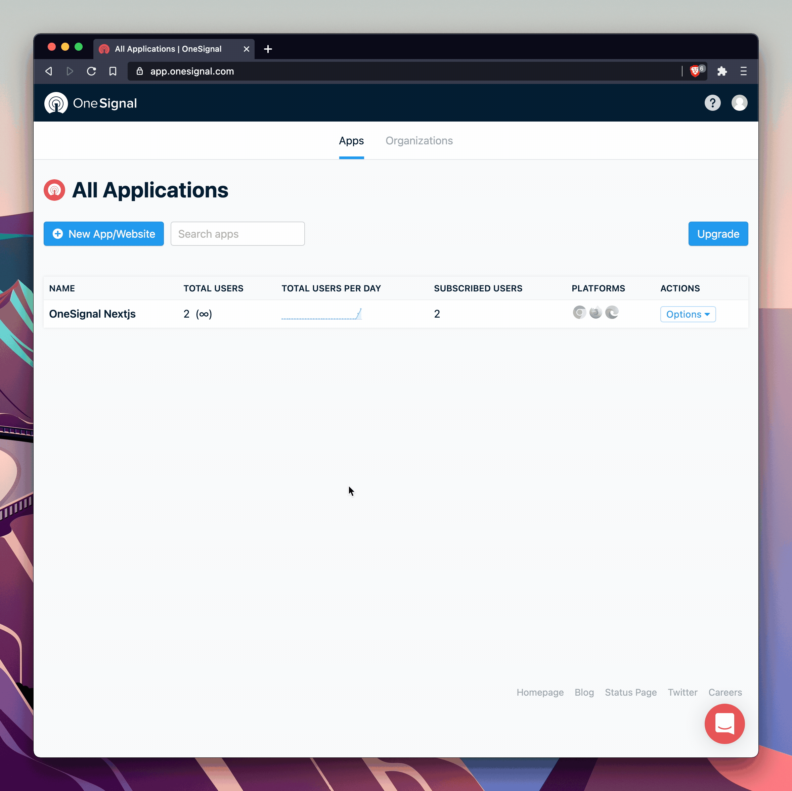

Navigating to Audience to view subscribed users.

Select _All Users_ from the second level menu to see a list of all subscribed
users.


I'm my only user 😅

### Sending a Message

Now that there's a subscriber, we can use OneSignal to push a web notification.
Navigate to the campaigns page by selecting _Messages_ from the top-level menu
then clicking the _New Push_ button.

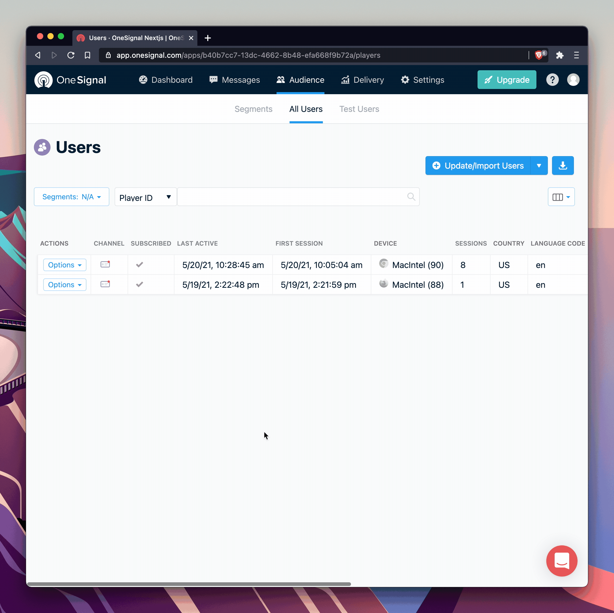

Creating a push notification.

Fill out the form to view a preview of the notification.

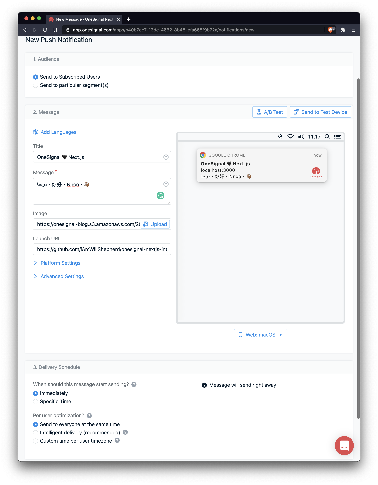

Notification is configured to go out immediately.

The notification preview shows what the message will look like for a Mac user
who subscribed to the site using Chrome. Selecting different platforms changes
the preview.


Previewing different platforms.

It's essential to check the preview for all platforms before pushing a
notification. Since this is a demo, I will push this notification even though
the layout is broken for the Android web platform.

### Pushing a Notification


Native notification displayed as a result of pushing the message.

Clicking the notification opens the URL I entered in the _Launch URL_ text
field.


Taking action on the notification.

## Conclusion

###### marketing content
